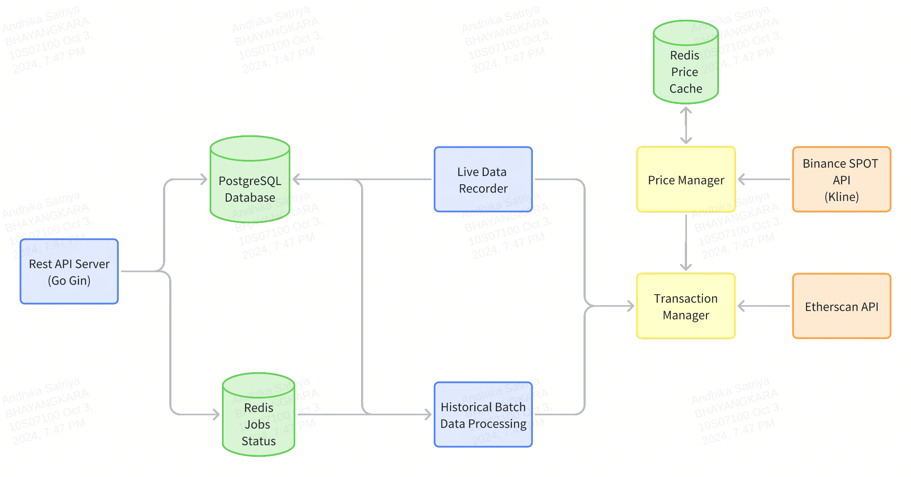

# Uniswap Fee Tracker


## Table of Contents

- [Overview](#overview)
- [Features](#features)
- [Architecture](#architecture)
  - [Why Go](#why-go)
  - [Why Redis](#why-redis)
  - [Why PostgreSQL](#why-postgresql)
- [Prerequisites](#prerequisites)
- [Getting Started](#getting-started)
  - [Clone the Repository](#clone-the-repository)
  - [Configure Environment Variables](#configure-environment-variables)
  - [Build and Run with Docker Compose](#build-and-run-with-docker-compose)
  - [Running Migrations](#running-migrations)
  - [Generating Swagger Documentation](#generating-swagger-documentation)
  - [Running Tests](#running-tests)
- [API Documentation](#api-documentation)
- [References](#references)

## Overview

**Uniswap Fee Tracker** is designed to track and analyze transaction fees for Uniswap WETH-USDC swaps. It provides real-time fee monitoring, historical data processing, and a RESTful API for easy access to fee information. Leveraging Go's robust concurrency model, PostgreSQL's reliability, and Redis's scalability, this application ensures efficient and scalable fee tracking for decentralized finance (DeFi) transactions.

## Features

- **Real-Time Fee Monitoring:** Track transaction fees in real-time, keeping users updated with the latest fee trends.

- **Goroutine Pool for Batch Processing:** Utilizes Go's goroutines to handle multiple batch processing tasks concurrently, ensuring efficient utilization of system resources.
  
- **Rate-Limited Clients:** Implements rate limiting to comply with free API usage plans from Etherscan and Binance, preventing service interruptions and ensuring smooth data retrieval.

- **Retry Mechanism:** Implement retry logic to handle temporary failurs from external APIs

- **Real-Time Fee Monitoring:** Provides real-time tracking of transaction fees, enabling users to stay updated with the latest fee trends.

- **Batch Historical Data Processing:** Efficiently process and store historical transaction data using concurrent workers and Go routines.

- **RESTful API:** Provides endpoint for user to query transaction details including transaction fee (in USDT and ETH),timestamp, block number, gas fee.

- **Swagger Documentation:** Automatically generated Swagger UI for interactive API exploration and testing.

## Architecture


### Go

- **Concurrency:** Go's lightweight goroutines and channels make it ideal for handling multiple concurrent tasks, such as batch processing and real-time data handling.
  
- **Performance:** Compiled to native binaries, Go ensures high performance and efficient resource utilization, crucial for data-intensive applications like fee tracking.

- **Simplicity:** Go's straightforward syntax and robust standard library expedite development while maintaining code readability and maintainability.

- **Built-in Tools:** Go provides built-in tools like testing, benchmarking, and profiling, allowing for rapid development and debugging of the codebase.

### Redis
- **Caching:** Redis serves as an in-memory data store, providing rapid access to frequently requested data (such as ETH/USDT conversion rate and batch job status), reducing latency, and offloading traffic from the primary database.
  
- **Scalability:** Redis's support for data structures and scalability ensures that the application can handle increased load without compromising performance.

- **Availability:** Redis offers high availability configurations, ensuring that cached data remains accessible even during partial system failures.


### PostgreSQL

- **Reliability:** PostgreSQL is a proven, reliable relational database system known for data integrity and robustness.
  
- **Scalability**: PostgreSQL can handle large volumes of transaction data efficiently. Its ability to scale both vertically (with larger servers) and horizontally (via replication) ensures that the system can grow as data requirements increase.


## Prerequisites

- **Docker:** Ensure Docker is installed on your system. [Install Docker](https://docs.docker.com/get-docker/)
  
- **Docker Compose:** Comes bundled with Docker Desktop. For Linux, follow [Docker Compose installation instructions](https://docs.docker.com/compose/install/).

- **Go (Optional):** If you plan to develop or modify the code outside Docker. [Install Go](https://golang.org/doc/install)

## Getting Started

### Clone the Repository

```bash
git clone https://github.com/winQe/uniswap-fee-tracker.git
cd uniswap-fee-tracker
```
### Configure Environment variables

Create a `.env` file in the root directory based on the provided .env.sample
Ensure that there's no port collision

### Build and Run with docker-compose
The API server and the live data recorder are two separate processes (and thus binaries). This docker compose script will run both at the same time.
```bash
docker-compose up --build
```
### Running Migrations
Database migrations are handled automatically by the migrate service in docker-compose.yml. If you need to run migrations manually, execute:

```bash
docker-compose run migrate
```
To run a specific migration step:
Up: Migrate up all available migrations.
```bash
docker-compose run migrate up
```
Down: Migrate down all migrations.
```bash
docker-compose run migrate down
```
Single Step Up:
```bash
docker-compose run migrate up 1
```
Single Step Down:
```bash
docker-compose run migrate down 1
```
### Generating Swagger Documentation
Swagger documentation is auto-generated and served via the Swagger UI. To generate or update Swagger docs:

Ensure you have swag installed. If not, install it using:

```bash
go install github.com/swaggo/swag/cmd/swag@latest
```
Generate Swagger documentation:

```bash
make swagger
```
### Running Tests
Execute the following command to run all tests with race detection and verbose output:

```bash
make test
```

## API Documentation
Access the interactive Swagger UI to explore and test the API endpoints:
http://localhost:8080/api/v1/swagger/index.html#/

## References
* https://goethereumbook.org/en/
* https://docs.etherscan.io/
* https://binance-docs.github.io/apidocs/spot/en/
